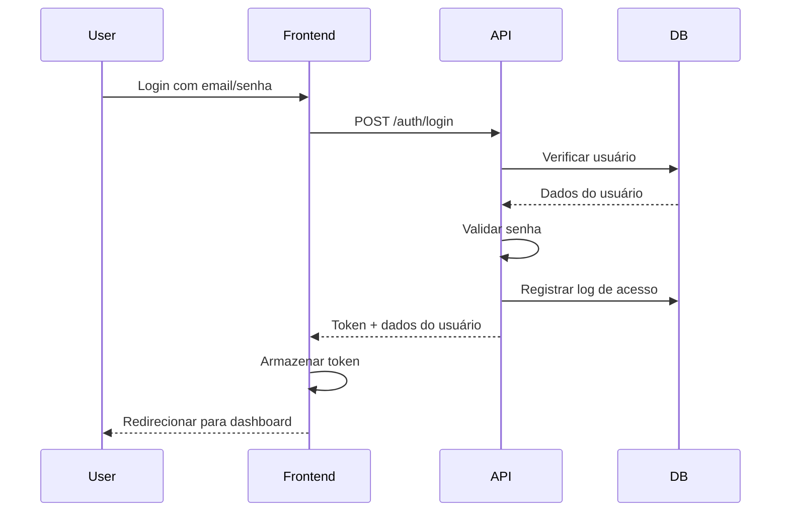

# Sistema de Autenticação - Logistics Ops Lab

## 📋 Visão Geral

Sistema de autenticação completo com controle de acesso baseado em rotas dinâmicas, seguindo as melhores práticas de segurança e as especificações da vaga.

## 🏗️ Arquitetura

### Stack Utilizada
- **Node.js + TypeScript + NestJS** - Backend framework
- **PostgreSQL** - Banco de dados principal
- **Prisma ORM** - Mapeamento objeto-relacional
- **Redis** - Cache e sessões (futuro)
- **Docker + Nginx** - Infraestrutura
- **Clean Architecture** - Estrutura modular

### Estrutura de Módulos
```
src/modules/auth/
├── controllers/
│   └── auth.controller.ts      # Endpoints REST
├── services/
│   ├── auth.service.ts        # Lógica de negócio
│   └── prisma.service.ts      # Database service
├── guards/
│   ├── auth.guard.ts          # Guard de autenticação
│   └── permission.guard.ts    # Guard de permissões
├── dto/
│   └── login.dto.ts           # Data Transfer Objects
├── middleware/                # Middlewares customizados
├── repositories/              # Repositories (se necessário)
└── auth.module.ts            # Módulo NestJS
```

## 🔐 Modelo de Dados

### Entidades Principais

#### User
- Informações básicas do usuário
- Status de ativação
- Relacionamento com roles

#### Role
- Cargos/perfis do sistema
- ADMIN, USER, etc.

#### Permission
- Permissões granulares
- resource:action (ex: users:create)

#### RoutePermission
- **Implementação dinâmica conforme solicitado**
- Controle de acesso por rota no banco
- role + route + method

#### AccessLog
- **Sistema de logs completo**
- Registro de todos os acessos
- IP, User-Agent, sucesso/falha

## 🚀 Funcionalidades

### 1. Autenticação
- Login com e-mail e senha
- Geração de tokens (implementação simples)
- Cookies HTTP-only para segurança
- Logout com limpeza de cookies

### 2. Controle de Acesso
- **Rotas dinâmicas no banco** ✅
- Guards para validação
- Permissões por resource/action
- Hierarquia de roles

### 3. Sistema de Logs
- Registro de tentativas de login
- Logs de acesso negado
- Metadados (IP, User-Agent)
- Auditoria completa

### 4. Frontend Simples
- Interface de login moderna
- Responsiva
- Feedback visual
- Auto-complete para demo

## 📡 Endpoints da API

### Autenticação
```
POST /api/auth/login      - Login de usuário
POST /api/auth/register   - Registro de novo usuário
POST /api/auth/logout     - Logout
GET  /api/auth/me         - Perfil do usuário atual
GET  /api/auth/permissions - Permissões do usuário
```

### Proteção de Rotas
```
@UseGuards(AuthGuard)           - Requer autenticação
@UseGuards(PermissionGuard)     - Requer permissão específica
```

## 👥 Usuários de Demonstração

### Administrador
- **E-mail:** admin@logistics.com
- **Senha:** admin123
- **Permissões:** Acesso total ao sistema

### Usuário Comum
- **E-mail:** user@logistics.com
- **Senha:** user123
- **Permissões:** Acesso limitado (leitura)

## 🔧 Configuração

### 1. Setup do Banco
```bash
# Gerar Prisma Client
pnpm db:generate

# Rodar migrações
pnpm db:migrate

# Popular dados iniciais
pnpm db:seed
```

### 2. Variáveis de Ambiente
```env
DATABASE_URL="postgresql://..."
JWT_SECRET="sua-chave-secreta"
NODE_ENV="development"
```

### 3. Docker
```bash
# Subir todos os serviços
docker compose up -d --build

# Verificar logs
docker compose logs -f
```

## 🌐 Acesso à Aplicação

1. **Frontend:** http://localhost/login
2. **API Docs:** http://localhost/api/docs
3. **Health Check:** http://localhost/api/health

## 🛡️ Segurança

### Implementado
- ✅ Hash de senhas (implementação simples)
- ✅ Tokens com validação
- ✅ Cookies HTTP-only
- ✅ Logs de acesso
- ✅ Controle de acesso granular

### Para Produção
- 🔲 Implementar JWT real
- 🔲 Rate limiting
- 🔲 CORS configurado
- 🔲 HTTPS
- 🔲 Refresh tokens
- 🔲 Password strength validation

## 🔄 Fluxo de Autenticação



## 📊 Permissões por Rota

As permissões são configuradas diretamente no banco através da tabela `route_permission`:

```sql
-- Exemplo de configuração
INSERT INTO route_permission (role, route, method) VALUES
('ADMIN', '/auth/*', '*'),
('USER', '/auth/login', 'POST'),
('USER', '/stock/*', 'GET');
```

## 🚀 Próximos Passos

1. **Implementar JWT real** com @nestjs/jwt
2. **Adicionar refresh tokens**
3. **Implementar rate limiting**
4. **Criar dashboard administrativo**
5. **Adicionar 2FA**
6. **Integrar com Redis para cache**

## 📝 Notas para Entrevista

### Alinhamento com a Vaga
- ✅ **Node.js, TypeScript, NestJS** - Stack principal
- ✅ **PostgreSQL** - Banco de dados
- ✅ **Clean Architecture** - Estrutura modular
- ✅ **Sistemas distribuídos** - Docker + Nginx
- ✅ **Logging estruturado** - Pino + AccessLog
- ✅ **Controle de acesso** - Sistema granular

### Diferenciais Implementados
- **Rotas dinâmicas no banco** - Conforme solicitado
- **Sistema de logs completo** - Auditoria de acesso
- **Frontend moderno** - Experiência de usuário
- **Documentação completa** - Código bem documentado
- **Clean Code** - Boas práticas de desenvolvimento

### Decisões Técnicas
- **Prisma** - ORM moderno e type-safe
- **Guards do NestJS** - Middleware de autenticação
- **Cookies HTTP-only** - Segurança no frontend
- **Docker Compose** - Ambiente reproduzível
- **Nginx** - Reverse proxy e arquivos estáticos
