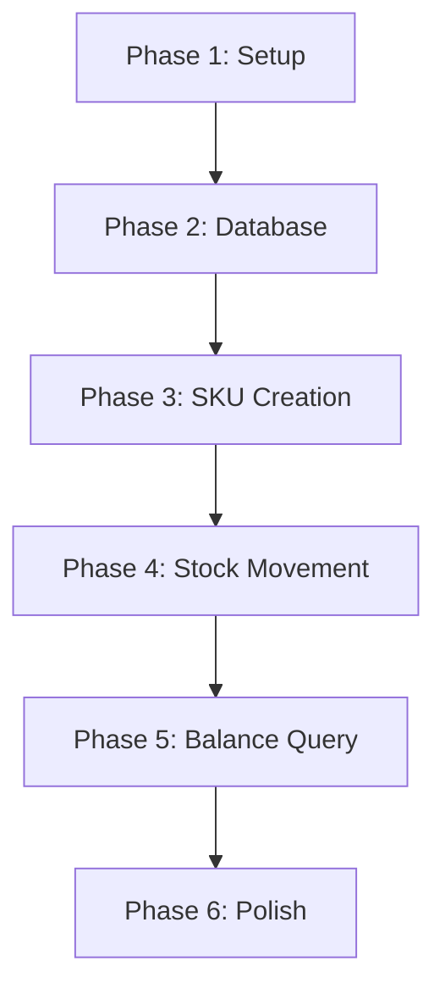

# Implementation Tasks: Simple WMS Stock Movement

**Feature**: 002-stock-movement-core  
**Total Tasks**: 26  
**Estimated Time**: 2-4 hours for single developer

---

## Phase 1: Setup & Foundation

**Goal**: Initialize project structure and basic configuration

### Independent Test Criteria
- `docker compose up -d --build` starts all services successfully
- `curl http://localhost:3000/health` returns 200

### Tasks

- [ ] T001 Create basic NestJS project structure in apps/api/
- [ ] T002 [P] Set up TypeScript configuration (strict mode)
- [ ] T003 [P] Configure Prisma with PostgreSQL connection
- [ ] T004 Create basic Docker Compose with API + PostgreSQL
- [ ] T005 Add health endpoint in main application
- [ ] T006 Configure environment variables (.env.example)

---

## Phase 2: Data Model & Database

**Goal**: Define core entities and database schema

### Independent Test Criteria
- Prisma migrations run successfully
- Database tables created with correct relationships

### Tasks

- [ ] T007 Create Prisma schema with SKU, StockBalance, StockMovement models
- [ ] T008 Generate and run initial database migration
- [ ] T009 [P] Create seed script for test SKU data

---

## Phase 3: User Story 1 - Criar SKU

**Goal**: Enable SKU creation with validation

### Independent Test Criteria
- `POST /skus` creates new SKU and returns 201
- Duplicate SKU code returns 422 with clear error

### Tasks

- [ ] T010 [US1] Create CreateSkuDto in apps/api/src/modules/stock/dto/
- [ ] T011 [US1] Create StockRepository with basic CRUD operations
- [ ] T012 [US1] Create StockService with SKU creation logic
- [ ] T013 [US1] Create StockController with POST /skus endpoint
- [ ] T014 [US1] Add validation for unique SKU code

---

## Phase 4: User Story 2 - Movimentar Estoque

**Goal**: Handle stock movements (in/out) with balance updates

### Independent Test Criteria
- `POST /stock/in` increases balance and records movement
- `POST /stock/out` decreases balance when sufficient
- Insufficient balance returns 422

### Tasks

- [ ] T015 [US2] Create StockMovementDto in apps/api/src/modules/stock/dto/
- [ ] T016 [US2] Extend StockService with movement logic
- [ ] T017 [US2] Add stock balance validation (prevent negative)
- [ ] T018 [US2] Create POST /stock/in endpoint in StockController
- [ ] T019 [US2] Create POST /stock/out endpoint in StockController

---

## Phase 5: User Story 3 - Consultar Saldo

**Goal**: Enable stock balance queries

### Independent Test Criteria
- `GET /stock/{sku}` returns current balance
- Non-existent SKU returns 404

### Tasks

- [ ] T020 [US3] Add balance query method to StockService
- [ ] T021 [US3] Create GET /stock/{sku} endpoint in StockController
- [ ] T022 [US3] Add 404 handling for missing SKUs

---

## Phase 6: Polish & Cross-Cutting

**Goal**: Final cleanup and documentation

### Independent Test Criteria
- All endpoints work end-to-end
- Code follows NestJS conventions
- README with usage examples

### Tasks

- [ ] T023 Add proper error handling and logging
- [ ] T024 Create README with API examples
- [ ] T025 Add basic input validation decorators
- [ ] T026 Verify all endpoints work with manual testing

---

## Constitution Compliance Notes

**Explicit Deviations (Justified in spec.md)**:
- No Redis/RabbitMQ setup (simplified demo scope)
- Focus on core backend skills (NestJS + PostgreSQL)
- Maintains layer separation and architectural principles

---

## Dependencies & Execution Order



### Story Dependencies
- **US1 (Criar SKU)**: Requires Phase 1-2
- **US2 (Movimentar Estoque)**: Requires US1 (needs SKUs)
- **US3 (Consultar Saldo)**: Requires US1-2 (needs SKUs and movements)

### Parallel Opportunities
- **Phase 1**: T002, T003, T004 can be done in parallel
- **Phase 3**: T010, T011 can be done in parallel
- **Phase 4**: T018, T019 can be done in parallel

---

## Implementation Strategy

### MVP Scope (First Working Version)
Complete Phase 1-3 for basic SKU creation:
- Project setup
- Database schema
- SKU CRUD operations

### Incremental Delivery
1. **After Phase 3**: Can create and list SKUs
2. **After Phase 4**: Full stock movement functionality
3. **After Phase 5**: Complete WMS demo
4. **After Phase 6**: Production-ready demo

### Testing Strategy
- Manual testing via curl/Postman
- Focus on happy paths and edge cases from spec
- No automated tests required (per scope constraints)

---

## File Structure Reference

```
apps/api/
├── src/
│   ├── modules/
│   │   └── stock/
│   │       ├── controllers/
│   │       │   └── stock.controller.ts      # T013, T018, T019, T021
│   │       ├── services/
│   │       │   └── stock.service.ts          # T012, T016, T020
│   │       ├── repositories/
│   │       │   └── stock.repository.ts       # T011
│   │       └── dto/
│   │           ├── create-sku.dto.ts         # T010
│   │           └── stock-movement.dto.ts     # T015
│   ├── config/
│   └── main.ts                               # T005
├── prisma/
│   ├── schema.prisma                         # T007
│   ├── migrations/                           # T008
│   └── seed.ts                               # T009
├── docker-compose.yml                        # T004
├── .env.example                              # T006
├── package.json                             # T001
└── README.md                                 # T024
```

---

## Success Metrics

- **Task Completion**: All 26 tasks completed
- **Functional Requirements**: All FR-001 to FR-004 implemented
- **User Stories**: All 3 stories working independently
- **Performance**: Endpoints respond < 200ms locally
- **Code Quality**: Clean NestJS structure with proper layer separation
